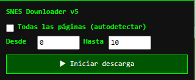

# SNES Downloader PRO 👑

**Última Actualización:** 15 de julio de 2026

Descarga automáticamente los archivos **.cht** de todos los juegos de **SNES** disponibles en GameHacking.org de forma rápida, automática y sin tener que abrir cada juego manualmente.

## 📖 Descripción

**SNES Downloader PRO** es un UserScript para **Tampermonkey** que automatiza la descarga de archivos de cheats (`.cht`) desde **GameHacking.org**.

El script recorre automáticamente todas las páginas del catálogo de Super Nintendo, detecta los juegos disponibles, obtiene todos sus grupos de códigos y genera un archivo `.cht` compatible con distintos emuladores.

También incluye una interfaz con barra de progreso, selección de rango de páginas, reintentos automáticos ante errores de conexión y la posibilidad de detener el proceso en cualquier momento.

---

# 📥 Instalación

1. Instala la extensión **Tampermonkey** para tu navegador.

2. Instala el script desde GitHub:

**➡️ [Instalar Script](https://github.com/wernser412/SNES-Cheat-Downloader/raw/refs/heads/main/Snes-downloader-pro.user.js)**

---

# 🎮 Emulador recomendado

Los archivos `.cht` generados por este proyecto están pensados para utilizarse con **Snes9x 1.63**, uno de los emuladores de Super Nintendo más compatibles y ampliamente utilizados.

**➡️ [Descargar Snes9x 1.63](https://github.com/snes9xgit/snes9x/releases/tag/1.63)**

Los archivos de cheats son compatibles con el formato utilizado por Snes9x, por lo que basta con copiarlos a la carpeta de cheats del emulador para comenzar a utilizarlos.

---

# 📦 Descarga completa

Si únicamente necesitas los archivos de cheats ya generados, puedes descargar el paquete completo sin ejecutar el script.

**➡️ [Descargar SNES_CHEATS_TODAS.zip](https://github.com/wernser412/SNES-Cheat-Downloader/raw/refs/heads/main/SNES_CHEATS_TODAS.zip)**

El archivo incluye todos los cheats recopilados por el script, organizados en archivos `.cht` listos para utilizar con emuladores compatibles.

---

# ✨ Características

* 🎮 Descarga automáticamente los cheats de todos los juegos de SNES.
* 📄 Genera archivos `.cht` compatibles con emuladores.
* 🔍 Detecta automáticamente el número total de páginas del catálogo.
* 📂 Permite descargar un rango específico de páginas.
* 📊 Barra de progreso en tiempo real.
* ⚡ Interfaz integrada dentro de la página.
* 🔄 Reintentos automáticos cuando una descarga falla.
* ⏱️ Tiempo máximo configurable para cada petición.
* 🛑 Permite cancelar el proceso en cualquier momento.
* 🧹 Elimina automáticamente códigos incompletos.
* 📝 Conserva el nombre original de la ROM al generar el archivo.

---

# 📋 Menú de Tampermonkey

El script añade la siguiente opción al menú de Tampermonkey:

| Opción                   | Función                                                       |
| ------------------------ | ------------------------------------------------------------- |
| 🚀 Abrir SNES Downloader | Abre la interfaz para iniciar la descarga de archivos `.cht`. |

---

# 🖥️ Uso

1. Abre la sección de **SNES** en GameHacking.org.
2. Ejecuta **🚀 Abrir SNES Downloader** desde el menú de Tampermonkey.
3. Elige una de las opciones:

   * Descargar todas las páginas (autodetección).
   * Descargar un rango específico de páginas.
4. Pulsa **▶ Iniciar descarga**.
5. Espera a que finalice el proceso.

Los archivos `.cht` se descargarán automáticamente en tu carpeta de descargas.

---

# ⚙️ Funciones del descargador

* Autodetecta la última página disponible del catálogo.
* Procesa cada juego de forma automática.
* Descarga todos los grupos de cheats asociados.
* Une todos los códigos en un único archivo `.cht`.
* Ignora códigos incompletos.
* Continúa trabajando aunque algún juego produzca un error.

---

# 📄 Requisitos

* Tampermonkey
* Navegador compatible con UserScripts
* Acceso a GameHacking.org

---

# 📄 Licencia

Este proyecto se distribuye bajo la licencia **MIT**.

Consulta el archivo **LICENSE** para más información.
